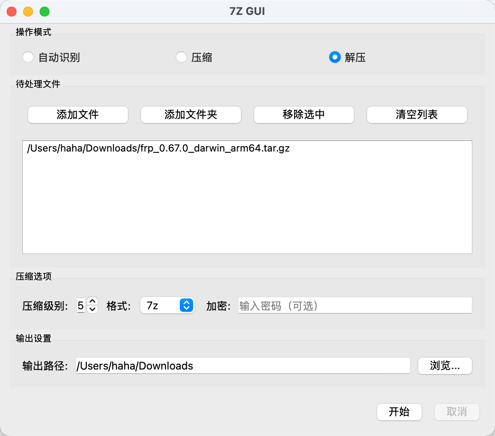

# 7Z GUI for macOS

一个功能完善的 7Z 图形界面工具，专为 macOS 设计。



## 功能特性

### 📦 压缩功能
- 支持多种压缩格式：7z、zip、tar、gzip
- 可调节压缩级别（0-9）
- 支持密码加密保护
- 批量压缩多个文件/文件夹
- 拖放支持，操作便捷

### 📂 解压功能
- 支持解压多种格式：7z、zip、rar、tar、gz、bz2、xz 等
- 自动识别压缩文件格式
- 支持批量解压
- 拖放支持

### 🎯 智能特性
- **自动识别模式**：自动判断是压缩还是解压
- **自动输出路径**：默认保存到原文件目录
- **文件关联支持**：双击压缩文件直接打开
- **独立应用**：无需安装 p7zip，内置 7z 二进制文件

## 安装方法

### 直接下载
1. 下载最新版本的 DMG 安装包
2. 打开 DMG 文件
3. 将「7Z GUI.app」拖放到「Applications」文件夹

### 从源码构建
```bash
# 克隆仓库
git clone https://github.com/your-username/7zGUI.git
cd 7zGUI

# 创建虚拟环境
python3 -m venv venv
source venv/bin/activate

# 安装依赖
pip install pyqt5 pyinstaller

# 打包应用
pyinstaller --name "7Z GUI" --windowed --add-data "src/resources:resources" src/main.py

# 生成的应用在 dist/7Z GUI.app
```

## 使用说明

### 基本操作
1. **打开应用**：双击「7Z GUI.app」
2. **添加文件**：拖放文件/文件夹到应用窗口，或点击「添加文件/文件夹」按钮
3. **选择模式**：自动识别或手动选择压缩/解压模式
4. **设置选项**：调整压缩级别、格式、密码等
5. **开始操作**：点击「开始」按钮

### 文件关联
在 macOS 中设置默认打开方式：
1. 右键点击压缩文件
2. 选择「打开方式」→「其他...」
3. 选择「7Z GUI.app」并勾选「始终以此方式打开」

## 系统要求

- macOS 10.15 或更高版本
- Apple Silicon 或 Intel 处理器

## 许可证

MIT License - 详见 [LICENSE](LICENSE) 文件

## 贡献

欢迎提交 Issue 和 Pull Request！

## 致谢

- 7-Zip (https://www.7-zip.org/)
- PyQt5 (https://pypi.org/project/PyQt5/)
- PyInstaller (https://www.pyinstaller.org/)